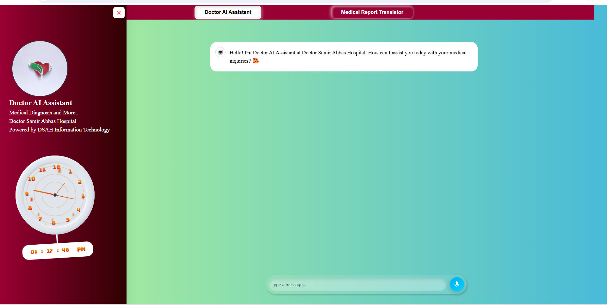

#   
# AI Doctor Assistant  
**Revolutionizing Healthcare Interactions with AI and RAG Technology**  

 
 
 
  
  
[](https://github.com/YourUsername/DSAH_DoctorAI_Assistant/issues)  
[](https://github.com/YourUsername/DSAH_DoctorAI_Assistant/stargazers)

---

## Overview  

**AI Doctor Assistant** is a state-of-the-art healthcare assistant based on Retrieval-Augmented Generation (RAG) technology. Trained on a comprehensive dataset of 250 medical handbooks at Doctor Samir Abbas Hospital in Jeddah, this assistant provides intelligent, informed responses, enabling enhanced doctor-patient interaction. The app is designed to support healthcare professionals by quickly retrieving and summarizing relevant medical knowledge in real time.  

---

## Features  

- **Instant Medical Knowledge Retrieval**: Powered by RAG, the assistant pulls relevant medical data on-demand.  
- **Enhanced Accuracy**: Built on a custom-trained dataset of medical handbooks, offering tailored responses.  
- **Interactive Chat Interface**: A seamless, responsive interface for medical consultations.  
- **Support for Text and Audio**: Allows input through both text and voice.  

---

## Tech Stack  

- **Python**: Backend processing, handling of AI model and data processing.  
- **Streamlit**: Interactive UI framework that brings the assistant to life in a web app format.  
- **CSS**: Custom styling for the app, creating a polished and user-friendly experience.  
- **TypeScript**: Adds type safety and enhances the JavaScript used in the app.  

---

## Installation  

1. **Clone the repository**:
   ```bash
   git clone https://github.com/Doctor-Samir-Abbas-Hospital/DSAH_DoctorAI_Assistant
   cd DSAH_DoctorAI_Assistant
   ```

2. **Install required packages**:
   ```bash
   pip install -r requirements.txt
   ```

3. **Run the Streamlit app**:
   ```bash
   streamlit run app.py
   ```

---

## Usage  

Upon launching the app, you’ll be greeted with a chat interface. Simply enter your query or use the microphone icon to record a question. The assistant will retrieve the relevant medical information and present it as a response.

1. **Text Input**: Type your medical question or query into the text box and press "Send".  
2. **Voice Input**: Use the microphone icon to record your question, and the assistant will convert it to text and process it.  
3. **Scroll**: Automatic scroll functionality will ensure new responses are displayed on-screen.  

---

## Project Structure  

```plaintext
DSAH_DoctorAI_Assistant
├── .streamlit/          # Streamlit configuration files
├── assets/              # Images and static resources
├── my_component/        # Custom Streamlit components
├── templates/           # HTML templates for the app
├── utils/               # Helper functions and utilities
├── .env                 # Environment variables
├── .gitignore           # Git ignore file
├── app.py               # Main application file
├── audio.mp3            # Sample audio file
├── audio.wav            # Sample audio file in WAV format
├── image.py             # Image processing utilities
├── main.py              # Entry point for main functions
├── README.md            # Project documentation
├── requirements.txt     # Dependencies
├── style.css            # Custom CSS for styling
└── translate.py         # Translation utilities
```

---

## Contributing  

We welcome contributions from the community! If you would like to contribute, please fork the repository and create a pull request. Ensure your code follows our guidelines and includes appropriate documentation.  

1. Fork the repository.  
2. Create a new branch for your feature.  
3. Make your changes.  
4. Submit a pull request.  

---

## License  

This project is licensed under the MIT License. See the [LICENSE](LICENSE) file for details.  

---

## Contact  

For inquiries, please reach out to Dr. Samir Abbas Hospital, Jeddah, or contact us through [GitHub Issues](https://github.com/YourUsername/DSAH_DoctorAI_Assistant/issues).  

---

**Note**: This project is strictly for educational and informational purposes. It is not intended to replace professional medical advice, diagnosis, or treatment.


  
**Empowering the future of healthcare with AI.**  

